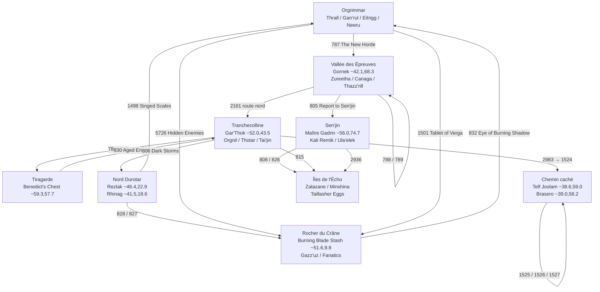
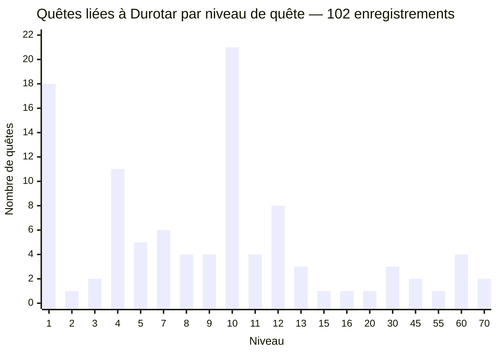

# Rapport analytique — toutes les quêtes liées à Durotar dans WoW Classic

## Résumé exécutif

J’ai retenu **102 enregistrements de quête ayant un lien géographique défendable avec Durotar** dans le corpus Classic/Vanilla : une quête est incluse si elle **commence à Durotar, se termine à Durotar, possède un objectif explicitement localisé à Durotar, ou utilise un PNJ/objet de quête situé à Durotar**. Ce périmètre est volontairement plus large que la seule catégorie « Durotar » de Wowhead : il récupère notamment les quêtes de classe, les quêtes qui partent d’Orgrimmar ou des Tarides mais envoient le joueur à Durotar, les chaînes de haut niveau qui reviennent à Sen’jin, ainsi que les événements saisonniers. Le modèle de données QuestieDB expose précisément les champs de départ, fin, niveau requis, niveau de quête, objectifs, prérequis, zone, drapeaux et statut répétable, ce qui permet cette vérification spatiale. citeturn47view0turn48view0turn48view1

Le cœur de Durotar reste massivement concentré entre les niveaux **1 et 13** : sur les 102 enregistrements retenus, **86 ont un niveau de quête ≤ 13**. Le niveau 10 est à lui seul le plus représenté, avec **21 quêtes**, essentiellement parce qu’il concentre les premières quêtes de classe — chasseur, guerrier, chaman, mage, prêtre, voleur et démoniste — autour de Tranchecolline, Sen’jin et des portes d’Orgrimmar. Cette concentration est cohérente avec la fonction de Durotar comme zone de départ orc/troll dans Classic. Le catalogue Wowhead Classic possède bien une catégorie dédiée aux quêtes de Durotar, tandis que Blizzard décrit WoW Classic comme la recréation du jeu original et ClassicDB documente explicitement sa compatibilité avec le client 1.12.x. citeturn47view3turn47view2turn47view4

Le corpus comprend également **neuf entrées à caractère calendaire ou événementiel identifiable** — Fête des moissons, Sanssaint, Fête lunaire, invasion du Fléau et entrées hivernales/Nouvel An — ainsi que quelques quêtes **legacy ou à accès spécial** telles que les remplacements d’anciens raptors et le bon de bienvenue de l’édition Collector. **Aucune quête quotidienne au sens moderne n’a été identifiée** dans ce corpus Vanilla ; six entrées sont en revanche répétables, notamment *Finding the Antidote*, les Saptas de terre/feu et *Incoming Gumdrop*. QuestieDB distingue explicitement le drapeau « Repeatable » et les drapeaux de quête, dont le bit « Daily » ; aucun des enregistrements retenus n’active ce dernier. citeturn48view0turn47view1

Deux cas initialement remontés par une simple jointure spatiale ont été **écartés** : les quêtes 1520 et 1521, *Call of Earth*, utilisent le même ID de « Minor Manifestation of Earth » que la chaîne orque, mais leurs textes et leur progression appartiennent en réalité à la branche taurène de Mulgore. C’est exactement le type de faux positif qu’une recherche par zone ou par ID de PNJ seul peut produire. À l’inverse, *Path of Defense* (1498), *Creature of the Void* (1501), *Hidden Enemies* (5726), *Finding the Antidote* (813) et la quête de Sanssaint 8312 doivent être ajoutées malgré un départ/une fin hors de Durotar parce que leurs objectifs y sont explicitement situés. Pour *Path of Defense*, ClassicDB indique expressément d’aller à Thunder Ridge en Durotar ; *Hidden Enemies* conduit à Skull Rock, à l’est d’Orgrimmar. citeturn48view12turn48view13

## Périmètre, méthode et niveau de confiance

Par **« WoW Classic »**, ce rapport entend **Classic Era / contenu Vanilla**, et non Cataclysm Classic, Mists of Pandaria Classic ou Season of Discovery. ClassicDB sert de référence historique 1.12 : son dépôt se présente comme une base de contenu pour le client *World of Warcraft* patch 1.12, compatible 1.12.1, 1.12.2 et 1.12.3. citeturn47view2 Wowhead Classic est utilisé comme source de consultation prioritaire ; par exemple, sa fiche française de la quête 788 donne bien le titre **« La dent tranchante »**, l’objectif de dix Sangliers tachetés et les récompenses correspondantes. citeturn48view3

J’ai ensuite croisé les données avec Questie/QuestieDB afin de ne pas dépendre du seul classement de zone. Son schéma fournit séparément `startedBy`, `finishedBy`, `requiredLevel`, `questLevel`, `objectives`, `preQuestSingle`, `zoneOrSort`, `questFlags` et `specialFlags`. citeturn47view0turn48view0 Questie fournit par ailleurs des traductions pour toutes les langues officielles de WoW Classic, dont le français ; ces données ont été utilisées pour contrôler les noms français lorsqu’ils étaient disponibles. citeturn48view2

Pour les XP marquées d’un astérisque (`XP*`), la valeur provient du champ de récompense ClassicDB normalisé avec la relation utilisée par la base entre XP et argent de compensation au niveau maximum. Cette relation a été contrôlée sur des fiches publiques : *Path of Defense* donne **625 XP / 3 pa 75 pc au niveau maximum**, soit 0,6 pc par XP dans le champ concerné ; *The Spider God* donne **4 850 XP / 29 pa 10 pc**, exactement le même rapport. citeturn48view12turn48view14 Lorsque je n’ai pas pu revalider sans ambiguïté un objet ou une quantité dans les données déjà collectées, j’écris **« à revalider dans CDB »** plutôt que d’inventer une valeur.

Le « niveau recommandé » ci-dessous est le **niveau de quête (`QuestLevel`)**, pas une recommandation subjective. Il peut donc, dans quelques vieilles données Vanilla, sembler inférieur au niveau minimum d’acceptation. Les noms d’objets de récompense restent parfois en anglais lorsque je n’ai pas revalidé leur localisation française officielle.

## Inventaire exhaustif consolidé

**Vallée des Épreuves et l’Antre**

| Quête | Départ → fin | Conditions / niveau | Objectif principal | Récompenses | Type / notes | Sources |
|---|---|---|---|---|---|---|
| **La nouvelle Horde** (*The New Horde*) — **787** | Eitrigg, Orgrimmar → Gornek, Antre | Horde, min. 1; rec. 1 | Se présenter à Gornek | 40 XP* | Unique; commence hors Durotar | [WH](https://www.wowhead.com/classic/fr/quest=787) · [CDB](https://classicdb.ch/?quest=787) |
| **Parchemin simple** (*Simple Parchment*) — **2383** | Gornek → Frang | Orc, Guerrier, min. 1; pré 788; rec. 1 | Parler à l’entraîneur guerrier | 40 XP* | Quête de classe | [WH](https://www.wowhead.com/classic/fr/quest=2383) · [CDB](https://classicdb.ch/?quest=2383) |
| **Tablette simple** (*Simple Tablet*) — **3065** | Gornek → Frang | Troll, Guerrier, min. 1; pré 788; rec. 1 | Parler à Frang | 40 XP* | Classe | [WH](https://www.wowhead.com/classic/fr/quest=3065) · [CDB](https://classicdb.ch/?quest=3065) |
| **Tablette gravée** (*Etched Tablet*) — **3082** | Gornek → Jen’shan | Troll, Chasseur, min. 1; pré 788; rec. 1 | Parler à Jen’shan | 40 XP* | Classe | [WH](https://www.wowhead.com/classic/fr/quest=3082) · [CDB](https://classicdb.ch/?quest=3082) |
| **Tablette codée** (*Encrypted Tablet*) — **3083** | Gornek → Rwag | Troll, Voleur, min. 1; pré 788; rec. 1 | Parler à Rwag | 40 XP* | Classe | [WH](https://www.wowhead.com/classic/fr/quest=3083) · [CDB](https://classicdb.ch/?quest=3083) |
| **Tablette runique** (*Rune-Inscribed Tablet*) — **3084** | Gornek → Shikrik | Troll, Chaman, min. 1; pré 788; rec. 1 | Parler à Shikrik | 40 XP* | Classe | [WH](https://www.wowhead.com/classic/fr/quest=3084) · [CDB](https://classicdb.ch/?quest=3084) |
| **Tablette bénie** (*Hallowed Tablet*) — **3085** | Gornek → Ken’jai | Troll, Prêtre, min. 1; pré 788; rec. 1 | Parler à Ken’jai | 40 XP* | Classe | [WH](https://www.wowhead.com/classic/fr/quest=3085) · [CDB](https://classicdb.ch/?quest=3085) |
| **Tablette glyphée** (*Glyphic Tablet*) — **3086** | Gornek → Mai’ah | Troll, Mage, min. 1; pré 788; rec. 1 | Parler à Mai’ah | 40 XP* | Classe | [WH](https://www.wowhead.com/classic/fr/quest=3086) · [CDB](https://classicdb.ch/?quest=3086) |
| **Parchemin gravé** (*Etched Parchment*) — **3087** | Gornek → Jen’shan | Orc, Chasseur, min. 1; pré 788; rec. 1 | Parler à Jen’shan | 40 XP* | Classe | [WH](https://www.wowhead.com/classic/fr/quest=3087) · [CDB](https://classicdb.ch/?quest=3087) |
| **Parchemin codé** (*Encrypted Parchment*) — **3088** | Gornek → Rwag | Orc, Voleur, min. 1; pré 788; rec. 1 | Parler à Rwag | 40 XP* | Classe | [WH](https://www.wowhead.com/classic/fr/quest=3088) · [CDB](https://classicdb.ch/?quest=3088) |
| **Parchemin runique** (*Rune-Inscribed Parchment*) — **3089** | Gornek → Shikrik | Orc, Chaman, min. 1; pré 788; rec. 1 | Parler à Shikrik | 40 XP* | Classe | [WH](https://www.wowhead.com/classic/fr/quest=3089) · [CDB](https://classicdb.ch/?quest=3089) |
| **Parchemin contaminé** (*Tainted Parchment*) — **3090** | Gornek → Nartok | Orc, Démoniste, min. 1; pré 788; rec. 1 | Parler à Nartok | 40 XP* | Classe | [WH](https://www.wowhead.com/classic/fr/quest=3090) · [CDB](https://classicdb.ch/?quest=3090) |
| **Votre place en ce monde** (*Your Place In The World*) — **4641** | Kaltunk → Gornek | Horde, min. 1; rec. 1 | Rejoindre Gornek | 40 XP* | Unique | [WH](https://www.wowhead.com/classic/fr/quest=4641) · [CDB](https://classicdb.ch/?quest=4641) |
| **Bienvenue !** (*Welcome!*) — **5843** | Bon « Valley of Trials Gift Voucher » → Magga | Min. 1; accès par objet | Échanger le bon | Choix : **Diablo Stone**, **Panda Collar** ou **Zergling Leash** | Accès spécial / édition Collector; pas une quête normale de leveling | [WH](https://www.wowhead.com/classic/fr/quest=5843) · [CDB](https://classicdb.ch/?quest=5843) |
| **La dent tranchante** (*Cutting Teeth*) — **788** | Gornek → Gornek | Horde, min. 1; rec. 2 | Tuer 10 Sangliers tachetés | **170 XP***; choix Soft Wool Boots / Battleworn Leather Gloves | Unique | [WH](https://www.wowhead.com/classic/fr/quest=788) · [CDB](https://classicdb.ch/?quest=788) |
| **L’aiguillon du scorpide** (*Sting of the Scorpid*) — **789** | Gornek → Gornek | Min. 1; pré 788; rec. 3 | 10 queues d’Ouvrier scorpide | **250 XP***; choix ceinture/cape | Unique | [WH](https://www.wowhead.com/classic/fr/quest=789) · [CDB](https://classicdb.ch/?quest=789) |
| **Surprise aux pommes de cactus de Galgar** (*Galgar’s Cactus Apple Surprise*) — **4402** | Galgar → Galgar | Min. 1; chaîne après 788; rec. 3 | Récolter 10 pommes de cactus | **380 XP***, **50 pc**, Cactus Apple Surprise | Unique | [WH](https://www.wowhead.com/classic/fr/quest=4402) · [CDB](https://classicdb.ch/?quest=4402) |
| **Les vils quasits** (*Vile Familiars*) — **792** | Zureetha Fargaze → Zureetha | Min. 2; rec. 4 | Tuer 12 Vile Familiars | **450 XP*** | Unique; variante générale | [WH](https://www.wowhead.com/classic/fr/quest=792) · [CDB](https://classicdb.ch/?quest=792) |
| **Le sapta de terre** (*Earth Sapta*) — **1463** | Canaga Earthcaller → Canaga | Chaman Horde, min./rec. 4 | Obtenir un nouveau sapta | **Earth Sapta** | **Répétable** | [WH](https://www.wowhead.com/classic/fr/quest=1463) · [CDB](https://classicdb.ch/?quest=1463) |
| **Les vils quasits** (*Vile Familiars*) — **1485** | Ruzan → Ruzan | Démoniste Horde, min. 1; rec. 4 | 6 têtes de Vile Familiar | XP/objets : à revalider dans CDB | Classe; exclusive d’une autre variante | [WH](https://www.wowhead.com/classic/fr/quest=1485) · [CDB](https://classicdb.ch/?quest=1485) |
| **Les vils quasits** (*Vile Familiars*) — **1499** | Ruzan → Zureetha | Démoniste Horde; pré 1485; rec. 4 | Aller voir Zureetha | XP : à revalider dans CDB | Classe; mène à 794 | [WH](https://www.wowhead.com/classic/fr/quest=1499) · [CDB](https://classicdb.ch/?quest=1499) |
| **L’appel de la terre** (*Call of Earth*) — **1516** | Canaga → Canaga | Chaman Horde, min. 4; rec. 4 | 2 sabots de Felstalker | À revalider dans CDB | Première étape du Totem de terre | [WH](https://www.wowhead.com/classic/fr/quest=1516) · [CDB](https://classicdb.ch/?quest=1516) |
| **L’appel de la terre** (*Call of Earth*) — **1517** | Canaga → Minor Manifestation of Earth, Spirit Rock | Chaman, pré 1516; rec. 4 | Boire le sapta à Spirit Rock | À revalider dans CDB | Classe | [WH](https://www.wowhead.com/classic/fr/quest=1517) · [CDB](https://classicdb.ch/?quest=1517) |
| **L’appel de la terre** (*Call of Earth*) — **1518** | Manifestation → Canaga | Chaman, pré 1517; rec. 4 | Rapporter le Rough Quartz | À revalider dans CDB; récompense de chaîne liée au Totem de terre | Classe | [WH](https://www.wowhead.com/classic/fr/quest=1518) · [CDB](https://classicdb.ch/?quest=1518) |
| **Les péons paresseux** (*Lazy Peons*) — **5441** | Foreman Thazz’rill → même PNJ | Min. 3; rec. 4 | Réveiller 5 péons | **450 XP*** | Unique | [WH](https://www.wowhead.com/classic/fr/quest=5441) · [CDB](https://classicdb.ch/?quest=5441) |
| **Au service de la spiritualité** (*In Favor of Spirituality*) — **5649** | Ken’jai → Tai’jin, Tranchecolline | Troll Prêtre, min. 5; rec. 4 | Aller voir Tai’jin | **90 XP*** | Classe; finit hors Vallée mais à Durotar | [WH](https://www.wowhead.com/classic/fr/quest=5649) · [CDB](https://classicdb.ch/?quest=5649) |
| **La pioche de Thazz’ril** (*Thazz’rill’s Pick*) — **6394** | Foreman Thazz’rill → même PNJ | Min. 3; pré 5441; rec. 4 | Récupérer la pioche dans la grotte | **450 XP***, **1 pa 50 pc** | Unique | [WH](https://www.wowhead.com/classic/fr/quest=6394) · [CDB](https://classicdb.ch/?quest=6394) |
| **Sarkoth** — **790** | Hana’zua → Hana’zua | Min. 1; rec. 5 | Tuer Sarkoth et prendre sa griffe | **450 XP*** | Unique | [WH](https://www.wowhead.com/classic/fr/quest=790) · [CDB](https://classicdb.ch/?quest=790) |
| **Le médaillon de la Lame ardente** (*Burning Blade Medallion*) — **794** | Zureetha → Zureetha | Min. 1; après 792 ou branche démoniste; rec. 5 | Tuer Yarrog Baneshadow; prendre le médaillon | **675 XP***; choix de pièce d’armure + potion de soins mineure | Unique | [WH](https://www.wowhead.com/classic/fr/quest=794) · [CDB](https://classicdb.ch/?quest=794) |
| **Sarkoth** — **804** | Hana’zua → Gornek | Min. 1; pré 790; rec. 5 | Faire le rapport à Gornek | **110 XP***; choix Soft Wool Vest / Battleworn Chain Leggings | Unique | [WH](https://www.wowhead.com/classic/fr/quest=804) · [CDB](https://classicdb.ch/?quest=804) |
| **Faire un rapport au Village de Sen’jin** (*Report to Sen’jin Village*) — **805** | Zureetha → Maître Gadrin, Sen’jin | Min. 1; pré 794; rec. 5 | Rejoindre Maître Gadrin | **230 XP*** | Unique; relie la zone de départ à Sen’jin | [WH](https://www.wowhead.com/classic/fr/quest=805) · [CDB](https://classicdb.ch/?quest=805) |

La fiche française Wowhead de 788 confirme directement le titre, l’objectif de dix Sangliers tachetés et le choix de récompense, ce qui sert de contrôle ponctuel de la localisation française. citeturn48view3

**Tranchecolline et Durotar central**

| Quête | Départ → fin | Conditions / niveau | Objectif | Récompenses | Type / notes | Sources |
|---|---|---|---|---|---|---|
| **Le fardeau d’un péon** (*A Peon’s Burden*) — **2161** | Ukor, route sud → Innkeeper Grosk, Tranchecolline | Min. 1; rec. 5 | Rejoindre l’auberge de Tranchecolline | À revalider dans CDB | Unique | [WH](https://www.wowhead.com/classic/fr/quest=2161) · [CDB](https://classicdb.ch/?quest=2161) |
| **Assumer ses responsabilités** (*Carry Your Weight*) — **791** | Furl Scornbrow → même PNJ | Min. 4; rec. 7 | Récupérer 8 Canvas Scraps | **625 XP***; **Handmade Leather Bag** | Unique | [WH](https://www.wowhead.com/classic/fr/quest=791) · [CDB](https://classicdb.ch/?quest=791) |
| **Un rapport à Orgnil** (*Report to Orgnil*) — **823** | Maître Gadrin, Sen’jin → Orgnil Soulscar, Tranchecolline | Min. 4; rec. 7 | Rejoindre Orgnil | **320 XP*** | Unique | [WH](https://www.wowhead.com/classic/fr/quest=823) · [CDB](https://classicdb.ch/?quest=823) |
| **Vêtements de la spiritualité** (*Garments of Spirituality*) — **5648** | Tai’jin → Tai’jin | Troll Prêtre, min. 5; pré 5649; rec. 4 | Soigner puis fortifier Grunt Kor’ja | **270 XP*** | Classe | [WH](https://www.wowhead.com/classic/fr/quest=5648) · [CDB](https://classicdb.ch/?quest=5648) |
| **Empiètement** / *Encroachment* — **837** | Gar’Thok → Gar’Thok | Min. 6; rec. 10 | Tuer Quilboars, Scouts, Dustrunners et Battleguards Razormane | XP/items : voir CDB | Unique | [WH](https://www.wowhead.com/classic/fr/quest=837) · [CDB](https://classicdb.ch/?quest=837) |
| **Le maléfice de faiblesse** (*Hex of Weakness*) — **5655** | Tai’jin → Ur’kyo, Orgrimmar | Troll Prêtre, min./rec. 10 | Parler à Ur’kyo | **210 XP*** | Classe; finit hors Durotar | [WH](https://www.wowhead.com/classic/fr/quest=5655) · [CDB](https://classicdb.ch/?quest=5655) |
| **Le maléfice de faiblesse** (*Hex of Weakness*) — **5657** | Ken’jai → Ur’kyo, Orgrimmar | Troll Prêtre, min./rec. 10 | Parler à Ur’kyo | **210 XP*** | Variante de départ Valley of Trials | [WH](https://www.wowhead.com/classic/fr/quest=5657) · [CDB](https://classicdb.ch/?quest=5657) |
| **Toucher de faiblesse** (*Touch of Weakness*) — **5660** | Tai’jin → Aelthalyste, Fossoyeuse | Mort-vivant Prêtre, min./rec. 10 | Rejoindre Aelthalyste | **210 XP*** | Classe; démarre à Durotar, finit à Fossoyeuse | [WH](https://www.wowhead.com/classic/fr/quest=5660) · [CDB](https://classicdb.ch/?quest=5660) |
| **Vétéran Uzzek** (*Veteran Uzzek*) — **1505** | Tarshaw Jaggedscar à Tranchecolline, ou autres maîtres guerriers → Uzzek, Tarides | Guerrier Horde, min./rec. 10 | Rejoindre Uzzek au Far Watch Post | À revalider dans CDB | Classe; l’un des départs est à Durotar | [WH](https://www.wowhead.com/classic/fr/quest=1505) · [CDB](https://classicdb.ch/?quest=1505) |
| **L’appel de Gan’rul** (*Gan’rul’s Summons*) — **1506** | Ophek, Tranchecolline → Gan’rul Bloodeye, Orgrimmar | Démoniste Horde, min./rec. 10 | Rejoindre Gan’rul | À revalider dans CDB | Classe | [WH](https://www.wowhead.com/classic/fr/quest=1506) · [CDB](https://classicdb.ch/?quest=1506) |
| **Therzok** — **1859** | Kaplak → Therzok, Orgrimmar | Orc Voleur, min./rec. 10 | Rejoindre Therzok | À revalider dans CDB | Classe | [WH](https://www.wowhead.com/classic/fr/quest=1859) · [CDB](https://classicdb.ch/?quest=1859) |
| **L’appel du feu** (*Call of Fire*) — **2983** | Swart → Kranal Fiss, Tarides | Chaman Horde, min./rec. 10 | Rejoindre Kranal Fiss | À revalider dans CDB | Classe; commence à Durotar | [WH](https://www.wowhead.com/classic/fr/quest=2983) · [CDB](https://classicdb.ch/?quest=2983) |
| **Dompter la bête** (*Taming the Beast*) — **6062** | Thotar → Thotar | Orc/Troll Chasseur, min./rec. 10 | Dompter un Dire Mottled Boar | **850 XP*** | Classe, apprentissage du familier | [WH](https://www.wowhead.com/classic/fr/quest=6062) · [CDB](https://classicdb.ch/?quest=6062) |
| **La voie du chasseur** (*The Hunter’s Path*) — **6067** | Thotar → Yaw Sharpmane, Mulgore | Tauren Chasseur, min./rec. 10 | Rejoindre le maître de Mulgore | **85 XP*** | Variante de déplacement; départ Durotar | [WH](https://www.wowhead.com/classic/fr/quest=6067) · [CDB](https://classicdb.ch/?quest=6067) |
| **La voie du chasseur** (*The Hunter’s Path*) — **6068** | Sian’dur, Orgrimmar → Thotar | Orc/Troll Chasseur, min./rec. 10 | Rejoindre Thotar | **85 XP*** | Finit à Durotar | [WH](https://www.wowhead.com/classic/fr/quest=6068) · [CDB](https://classicdb.ch/?quest=6068) |
| **La voie du chasseur** (*The Hunter’s Path*) — **6070** | Kary Thunderhorn, Pitons-du-Tonnerre → Thotar | Orc/Troll Chasseur, min./rec. 10 | Rejoindre Thotar | **85 XP*** | Finit à Durotar | [WH](https://www.wowhead.com/classic/fr/quest=6070) · [CDB](https://classicdb.ch/?quest=6070) |
| **Dompter la bête** (*Taming the Beast*) — **6083** | Thotar → Thotar | Orc/Troll Chasseur, pré 6062; rec. 10 | Dompter un Surf Crawler | **850 XP*** | Classe | [WH](https://www.wowhead.com/classic/fr/quest=6083) · [CDB](https://classicdb.ch/?quest=6083) |
| **Dompter la bête** (*Taming the Beast*) — **6082** | Thotar → Thotar | Orc/Troll Chasseur, pré 6083; rec. 10 | Dompter un Armored Scorpid | **850 XP*** | Classe | [WH](https://www.wowhead.com/classic/fr/quest=6082) · [CDB](https://classicdb.ch/?quest=6082) |
| **Entraîner la bête** (*Training the Beast*) — **6081** | Thotar → Ormak Grimshot, Orgrimmar | Orc/Troll Chasseur, pré 6082; rec. 10 | Rejoindre Ormak | **420 XP***; récompenses de sort/compétence de familier | Classe; finit hors Durotar | [WH](https://www.wowhead.com/classic/fr/quest=6081) · [CDB](https://classicdb.ch/?quest=6081) |
| **Conscrit de la Horde** (*Conscript of the Horde*) — **840** | Takrin Pathseeker → Kargal Battlescar, Tarides | Horde, min. 10; rec. 12 | Aller au carrefour de la chaîne des Tarides | Récompense : voir CDB | Unique; départ Durotar | [WH](https://www.wowhead.com/classic/fr/quest=840) · [CDB](https://classicdb.ch/?quest=840) |
| **Faire un rapport à Anastasia** (*Report to Anastasia*) — **1959** | Plusieurs maîtres mages, dont Un’Thuwa à Sen’jin → Anastasia Hartwell, Fossoyeuse | Mage, min./rec. 15 | Rejoindre Anastasia | À revalider dans CDB | Un des départs est à Durotar | [WH](https://www.wowhead.com/classic/fr/quest=1959) · [CDB](https://classicdb.ch/?quest=1959) |
| **À Orgrimmar !** (*To Orgrimmar!*) — **2380** | Kaplak → Shenthul, Orgrimmar | Orc Voleur, min./rec. 16 | Rejoindre Shenthul | À revalider dans CDB | Classe | [WH](https://www.wowhead.com/classic/fr/quest=2380) · [CDB](https://classicdb.ch/?quest=2380) |
| **L’appel de l’eau** (*Call of Water*) — **2985** | Swart → Islen Waterseer, Tarides | Chaman Horde, min./rec. 20 | Rejoindre Islen | **775 XP*** | Classe; début à Durotar | [WH](https://www.wowhead.com/classic/fr/quest=2985) · [CDB](https://classicdb.ch/?quest=2985) |
| **L’Ancienne Runetotem** (*Runetotem the Elder*) — **8670** | Elder Runetotem, Tranchecolline → même PNJ | Min. 1; quête niv. 60 | Honorer l’Ancien | **Coin of Ancestry**; récompense/courrier de fête | **Fête lunaire**, non quotidienne | [WH](https://www.wowhead.com/classic/fr/quest=8670) · [CDB](https://classicdb.ch/?quest=8670) |

**Fort de Tiragarde et côte orientale**

| Quête | Départ → fin | Conditions / niveau | Objectif | Récompenses | Type / notes | Sources |
|---|---|---|---|---|---|---|
| **Vaincre les traîtres** (*Vanquish the Betrayers*) — **784** | Gar’Thok → Gar’Thok | Min. 3; rec. 7 | Tuer 10 Kul Tiras Sailors, 8 Marines et Lieutenant Benedict | **625 XP***, **1 pa 75 pc** | Unique | [WH](https://www.wowhead.com/classic/fr/quest=784) · [CDB](https://classicdb.ch/?quest=784) |
| **Des épaves** (*From The Wreckage….*) — **825** | Gar’Thok → Gar’Thok | Min. 3; pré 784; rec. 8 | Récupérer 3 Gnomish Tools dans les épaves | **700 XP***; choix Dirt-trodden Boots / Sandrunner Wristguards / Wide Metal Girdle | Unique | [WH](https://www.wowhead.com/classic/fr/quest=825) · [CDB](https://classicdb.ch/?quest=825) |
| **Les ordres de l’amiral** (*The Admiral’s Orders*) — **830** | **Benedict’s Chest / Aged Envelope**, Tiragarde → Gar’Thok | Min. 1; rec. 7 | Trouver et remettre les ordres | **625 XP*** | Démarre par un objet | [WH](https://www.wowhead.com/classic/fr/quest=830) · [CDB](https://classicdb.ch/?quest=830) |

**Village de Sen’jin, Îles de l’Écho et sud de Durotar**

| Quête | Départ → fin | Conditions / niveau | Objectif | Récompenses | Type / notes | Sources |
|---|---|---|---|---|---|---|
| **Déjouer l’agression des Kolkar** (*Thwarting Kolkar Aggression*) — **786** | Lar Prowltusk → même PNJ | Min. 5; rec. 8 | Détruire les 3 plans d’attaque Kolkar | **700 XP***; choix Seasoned Fighter’s Cloak / Heavy Cord Bracers | Unique | [WH](https://www.wowhead.com/classic/fr/quest=786) · [CDB](https://classicdb.ch/?quest=786) |
| **Des œufs pour l’omelette** (*Break a Few Eggs*) — **815** | Cook Torka, Tranchecolline → même PNJ | Min. 6; rec. 8 | Ramasser des Taillasher Eggs aux Îles de l’Écho | **700 XP***, **2 pa 25 pc** | Objectifs au sud | [WH](https://www.wowhead.com/classic/fr/quest=815) · [CDB](https://classicdb.ch/?quest=815) |
| **Proie nécessaire** (*Practical Prey*) — **817** | Vel’rin Fang → même PNJ | Min. 5; rec. 8 | 4 peaux de Tigre de Durotar | **700 XP***, **2 pa 25 pc** | Unique | [WH](https://www.wowhead.com/classic/fr/quest=817) · [CDB](https://classicdb.ch/?quest=817) |
| **Un esprit parfaitement éduqué** (*A Solvent Spirit*) — **818** | Master Vornal → même PNJ | Min. 5; rec. 7 | 4 Intact Makrura Eyes + 8 Crawler Mucus | **625 XP***, **1 pa 75 pc**, **Really Sticky Glue** | Unique | [WH](https://www.wowhead.com/classic/fr/quest=818) · [CDB](https://classicdb.ch/?quest=818) |
| **Crâne de Minshina** (*Minshina’s Skull*) — **808** | Maître Gadrin → même PNJ | Min. 4; rec. 9 | Récupérer le crâne de Minshina aux Îles | **775 XP*** | Unique | [WH](https://www.wowhead.com/classic/fr/quest=808) · [CDB](https://classicdb.ch/?quest=808) |
| **Zalazane** — **826** | Maître Gadrin → même PNJ | Min. 4; rec. 10 | Tuer Zalazane, 8 Hexed Trolls et 8 Voodoo Trolls | **850 XP*** | Unique; Îles de l’Écho | [WH](https://www.wowhead.com/classic/fr/quest=826) · [CDB](https://classicdb.ch/?quest=826) |
| **Parler à Un’thuwa** (*Speak with Un’thuwa*) — **1883** | Uthel’nay, Orgrimmar → Un’Thuwa, Sen’jin | Mort-vivant/Troll Mage, min./rec. 10 | Rejoindre Un’Thuwa | À revalider dans CDB | Classe; finit à Durotar | [WH](https://www.wowhead.com/classic/fr/quest=1883) · [CDB](https://classicdb.ch/?quest=1883) |
| **Tas de Ju-Ju** (*Ju-Ju Heaps*) — **1884** | Un’Thuwa → Un’Thuwa | Mage Mort-vivant/Troll; pré 1883; rec. 10 | Détruire 4 Ju-Ju Heaps aux Îles de l’Écho | À revalider dans CDB | Classe | [WH](https://www.wowhead.com/classic/fr/quest=1884) · [CDB](https://classicdb.ch/?quest=1884) |
| **La voie du chasseur** (*The Hunter’s Path*) — **6069** | Kali Remik, Sen’jin → Thotar, Tranchecolline | Orc/Troll Chasseur, min./rec. 10 | Rejoindre Thotar | **85 XP*** | Classe; entièrement Durotar | [WH](https://www.wowhead.com/classic/fr/quest=6069) · [CDB](https://classicdb.ch/?quest=6069) |
| **Ula’elek et les Gantelets de brutalité** (*Ula’elek and the Brutal Gauntlets*) — **1839** | Thun’grim Firegaze, Tarides → Ula’elek, Sen’jin | Guerrier Horde, min. 20; pré 1838; rec. 30 | Rejoindre Ula’elek | À revalider dans CDB | Haut niveau; finit à Durotar | [WH](https://www.wowhead.com/classic/fr/quest=1839) · [CDB](https://classicdb.ch/?quest=1839) |
| **Sabots de satyre** (*Satyr Hooves*) — **1842** | Ula’elek → Ula’elek | Guerrier Horde, min. 20; pré 1839; rec. 30 | Apporter 7 Uncloven Satyr Hooves | À revalider dans CDB | Départ/fin Durotar, objectifs hors zone | [WH](https://www.wowhead.com/classic/fr/quest=1842) · [CDB](https://classicdb.ch/?quest=1842) |
| **Gantelets de brutalité** (*Brutal Gauntlets*) — **1843** | Ula’elek → Ula’elek | Guerrier Horde; pré 1842; rec. 30 | Finaliser la fabrication des gantelets | Récompense de classe : voir CDB | Haut niveau | [WH](https://www.wowhead.com/classic/fr/quest=1843) · [CDB](https://classicdb.ch/?quest=1843) |
| **Consulter Maître Gadrin** (*Consult Master Gadrin*) — **2935** | Apothecary Lydon, Contreforts → Maître Gadrin | Min. 40; rec. 45 | Rejoindre Gadrin à Sen’jin | À revalider dans CDB | Finit à Durotar | [WH](https://www.wowhead.com/classic/fr/quest=2935) · [CDB](https://classicdb.ch/?quest=2935) |
| **Le dieu-araignée** (*The Spider God*) — **2936** | Maître Gadrin → Maître Gadrin | Min. 40; pré 2935; rec. 45; Donjon | Lire la tablette de Theka dans Zul’Farrak et revenir | **4 850 XP***; **150 réputation Trolls Darkspear** | Départ/fin Durotar, objectif à Zul’Farrak | [WH](https://www.wowhead.com/classic/fr/quest=2936) · [CDB](https://classicdb.ch/?quest=2936) |
| **L’invocation de Shadra** (*Summoning Shadra*) — **2937** | Maître Gadrin → Apothecary Lydon | Min. 40; pré 2936; rec. 55 | Continuer la chaîne de Shadra hors Durotar | À revalider dans CDB | Commence à Durotar | [WH](https://www.wowhead.com/classic/fr/quest=2937) · [CDB](https://classicdb.ch/?quest=2937) |
| **Remplacement de raptor ivoire** (*Ivory Raptor Replacement*) — **7664** | Zjolnir → Zjolnir | Min. 60; quête niv. 1; ancien propriétaire concerné | Échanger une ancienne monture | Choix : **Swift Blue / Olive / Orange Raptor** | **Répétable, legacy**; disponibilité actuelle non garantie | [WH](https://www.wowhead.com/classic/fr/quest=7664) · [CDB](https://classicdb.ch/?quest=7664) |
| **Remplacement de raptor rouge** (*Red Raptor Replacement*) — **7665** | Zjolnir → Zjolnir | Min. 60; quête niv. 1 | Même logique d’échange | Choix : **Swift Blue / Olive / Orange Raptor** | **Répétable, legacy** | [WH](https://www.wowhead.com/classic/fr/quest=7665) · [CDB](https://classicdb.ch/?quest=7665) |
| **Boule de gomme en approche** (*Incoming Gumdrop*) — **8358** | Kali Remik → Kali Remik | Min. 10; quête niv. 60; liée à 8312 | Effectuer le tour demandé par Kali | **Darkspear Gumdrop** | **Répétable, Sanssaint** | [WH](https://www.wowhead.com/classic/fr/quest=8358) · [CDB](https://classicdb.ch/?quest=8358) |
| **Des bonbons de la Sanssaint pour Spoops !** (*Hallow’s End Treats for Spoops!*) — **8312** | Spoops, Orgrimmar → Spoops | Horde, min. 10; niv. quête 60 | Obtenir quatre friandises; l’une vient de Kali Remik à Sen’jin | **1 650 XP***, **30 Hallow’s End Pumpkin Treats** | **Événementielle**; seulement un objectif est à Durotar | [WH](https://www.wowhead.com/classic/fr/quest=8312) · [CDB](https://classicdb.ch/?quest=8312) |

ClassicDB confirme pour *The Spider God* qu’il s’agit d’une quête de niveau 45 requérant le niveau 40, donnée et rendue à Maître Gadrin, avec un objectif à Zul’Farrak et une récompense de 4 850 XP. citeturn48view14

**Nord de Durotar — Crête du Tonnerre, ravin de Tranchevent, Rocher du Crâne et portes d’Orgrimmar**

| Quête | Départ → fin | Conditions / niveau | Objectif | Récompenses | Type / notes | Sources |
|---|---|---|---|---|---|---|
| **Besoin d’un remède** (*Need for a Cure*) — **812** | Rhinag, ~41.5/18.6 → Rhinag | Min. 7; rec. 9 | Obtenir l’antidote dans le délai de quête | **975 XP***; choix Charging Buckler / Light Scorpid Armor | Unique; quête chronométrée | [WH](https://www.wowhead.com/classic/fr/quest=812) · [CDB](https://classicdb.ch/?quest=812) |
| **La recherche de l’antidote** (*Finding the Antidote*) — **813** | Kor’ghan, Orgrimmar → Kor’ghan | Horde, min. 7; **parent 812**; rec. 9 | Apporter 4 Venomtail Poison Sacs provenant des scorpides de Durotar | **Venomtail Antidote** | **Répétable**; départ/fin hors Durotar, objectif dedans | [WH](https://www.wowhead.com/classic/fr/quest=813) · [CDB](https://classicdb.ch/?quest=813) |
| **Les vents du désert** (*Winds in the Desert*) — **834** | Rezlak, ~46.4/22.9 → Rezlak | Min. 7; rec. 9 | Récupérer 5 sacs de ravitaillement | **775 XP***, **3 pa** | Unique | [WH](https://www.wowhead.com/classic/fr/quest=834) · [CDB](https://classicdb.ch/?quest=834) |
| **Sécuriser les lignes** (*Securing the Lines*) — **835** | Rezlak → Rezlak | Min. 7; pré 834; rec. 11 | Tuer 12 Dustwind Savages et 8 Storm Witches | **875 XP***; choix Harpy Wing Clipper / Hickory Shortbow / Blemished Wooden Staff | Unique | [WH](https://www.wowhead.com/classic/fr/quest=835) · [CDB](https://classicdb.ch/?quest=835) |
| **L’égaré** (*Lost But Not Forgotten*) — **816** | Misha Tor’kren → même PNJ | Min. 8; rec. 11 | Retrouver l’amulette de Kron sur les crocilisques | **875 XP*** | Unique | [WH](https://www.wowhead.com/classic/fr/quest=816) · [CDB](https://classicdb.ch/?quest=816) |
| **Noirs orages** (*Dark Storms*) — **806** | Orgnil Soulscar → Orgnil | Min. 4; pré 823; rec. 12 | Tuer Fizzle Darkstorm et prendre sa griffe | **900 XP***, **Tiger Hide Boots** | Objectif au nord de Durotar | [WH](https://www.wowhead.com/classic/fr/quest=806) · [CDB](https://classicdb.ch/?quest=806) |
| **Margoz** — **828** | Orgnil → Margoz | Min. 4; pré 806; rec. 12 | Rejoindre Margoz près du Rocher du Crâne | **90 XP*** | Unique | [WH](https://www.wowhead.com/classic/fr/quest=828) · [CDB](https://classicdb.ch/?quest=828) |
| **Rocher du crâne** (*Skull Rock*) — **827** | Margoz → Margoz | Min. 4; pré 828; rec. 12 | Récupérer les Searing Collars des membres de la Lame ardente | **900 XP*** | Unique | [WH](https://www.wowhead.com/classic/fr/quest=827) · [CDB](https://classicdb.ch/?quest=827) |
| **Neeru Fireblade** — **829** | Margoz → Neeru, Orgrimmar | Min. 4; pré 827; rec. 12 | Aller voir Neeru | **460 XP*** | Commence Durotar, finit Orgrimmar | [WH](https://www.wowhead.com/classic/fr/quest=829) · [CDB](https://classicdb.ch/?quest=829) |
| **Ombres ardentes** (*Burning Shadows*) — **832** | Œil de Burning Shadow, obtenu sur Gazz’uz → Neeru, Orgrimmar | Min. 4; rec. 12 | Utiliser le drop de Gazz’uz et le remettre à Neeru | **675 XP*** | Quête déclenchée par objet; départ à Skull Rock | [WH](https://www.wowhead.com/classic/fr/quest=832) · [CDB](https://classicdb.ch/?quest=832) |
| **La voie de la défense** (*Path of Defense*) — **1498** | Uzzek, Far Watch Post dans les Tarides → Uzzek | Guerrier Horde, min./rec. 10; pré 1505 | Aller à **Thunder Ridge, Durotar**, prendre 5 Singed Scales | **625 XP***; apprentissage **Path of Defense** | **Départ et fin hors Durotar; objectif explicitement à Durotar** | [WH](https://www.wowhead.com/classic/fr/quest=1498) · [CDB](https://classicdb.ch/?quest=1498) |
| **Créature du Vide** (*Creature of the Void*) — **1501** | Gan’rul Bloodeye, Orgrimmar → Gan’rul | Démoniste Horde, min. 10; pré 1506; rec. 11 | Récupérer la **Tablet of Verga** dans la Burning Blade Stash au nord-est de Durotar | Récompense de classe/XP : voir CDB | **Départ/fin hors Durotar; objectif à Durotar** | [WH](https://www.wowhead.com/classic/fr/quest=1501) · [CDB](https://classicdb.ch/?quest=1501) |
| **Ennemis cachés** (*Hidden Enemies*) — **5726** | Thrall, Orgrimmar → Thrall | Horde, min. 9; rec. 12 | Trouver une Lieutenant’s Insignia sur les Burning Blade de Skull Rock | **900 XP***, **2 pa 50 pc** | **Départ/fin Orgrimmar; objectif à Durotar** | [WH](https://www.wowhead.com/classic/fr/quest=5726) · [CDB](https://classicdb.ch/?quest=5726) |
| **Enquêter au sujet du Fléau à Orgrimmar** (*Investigate the Scourge of Orgrimmar*) — **9263** | Lieutenant Dagel, Orgrimmar → Dagel | Min. 1; rec. 10 | Enquêter sur les forces du Fléau présentes devant Orgrimmar/Durotar | **650 XP***, **2 pa 50 pc** | **Événement invasion du Fléau**; non permanent | [WH](https://www.wowhead.com/classic/fr/quest=9263) · [CDB](https://classicdb.ch/?quest=9263) |
| **En l’honneur d’un héros** (*Honoring a Hero*) — **8150** | Javnir Nashak, ~46.1/13.8 devant Orgrimmar → même PNJ | Min. 30; niv. quête 60 | Déposer un hommage au monument de Grom en Ashenvale et revenir | **6 600 XP***, **The Horde’s Hellscream**, courrier associé | **Fête des moissons**; objectifs hors Durotar mais départ/fin dedans | [WH](https://www.wowhead.com/classic/fr/quest=8150) · [CDB](https://classicdb.ch/?quest=8150) |
| **Des cadeaux d’hiver** (*Winter’s Presents*) — **8827** | Wonderform Operator, notamment spawn de Durotar → Greatfather Winter, Forgefer | Alliance, min./rec. 1 | Rejoindre Greatfather Winter | **10 XP*** | Saisonnier; starter multi-zone; cas marginal | [WH](https://www.wowhead.com/classic/fr/quest=8827) · [CDB](https://classicdb.ch/?quest=8827) |
| **Des cadeaux d’hiver** (*Winter’s Presents*) — **8828** | Wonderform Operator, notamment Durotar → Great-father Winter, Orgrimmar | Horde, min./rec. 1 | Rejoindre Great-father Winter | **10 XP*** | Saisonnier; starter multi-zone | [WH](https://www.wowhead.com/classic/fr/quest=8828) · [CDB](https://classicdb.ch/?quest=8828) |
| **Les fêtes du Nouvel An !** (*New Year Celebrations!*) — **8860** | Wonderform Operator, dont spawn Durotar → Innkeeper Allison, Hurlevent | Alliance, min. 60; niv. quête **70** | Livrer les Smokywood Supplies | Aucune récompense directe fiable enregistrée | **Legacy / anomalie de données**, niveau 70 incompatible avec le cap Vanilla; disponibilité Classic Era non affirmée | [WH](https://www.wowhead.com/classic/fr/quest=8860) · [CDB](https://classicdb.ch/?quest=8860) |
| **Les fêtes du Nouvel An !** (*New Year Celebrations!*) — **8861** | Wonderform Operator, dont spawn Durotar → Innkeeper Pala, Pitons-du-Tonnerre | Horde, min. 60; niv. quête **70** | Livrer les Smokywood Supplies | Aucune récompense directe fiable enregistrée | **Legacy / anomalie de données**; même réserve | [WH](https://www.wowhead.com/classic/fr/quest=8861) · [CDB](https://classicdb.ch/?quest=8861) |

Le caractère réellement « transfrontalier » de *Path of Defense* est particulièrement bien documenté : ClassicDB donne Uzzek dans les Tarides comme donneur/récepteur mais dit explicitement d’aller à **Thunder Ridge in Durotar** pour tuer les thunder lizards et récupérer cinq Singed Scales. citeturn48view12 Pour *Hidden Enemies*, les données et la fiche Wowhead convergent vers **Skull Rock**, autour de 54–55/8–10, à l’est d’Orgrimmar, où l’insigne tombe sur les Burning Blade. citeturn48view13

**Chemin caché et sanctuaire chaman**

| Quête | Départ → fin | Conditions / niveau | Objectif | Récompenses | Type / notes | Sources |
|---|---|---|---|---|---|---|
| **L’appel du feu** (*Call of Fire*) — **1524** | Kranal Fiss, Tarides → Telf Joolam, Durotar | Chaman Horde, min. 10; pré branche 1522/1523/2983/2984; rec. 11 | Apporter la Torch of the Dormant Flame à Telf Joolam | **650 XP*** | Finit à Durotar | [WH](https://www.wowhead.com/classic/fr/quest=1524) · [CDB](https://classicdb.ch/?quest=1524) |
| **L’appel du feu** (*Call of Fire*) — **1525** | Telf Joolam → Telf Joolam | Chaman, pré 1524; rec. 12 | Apporter Fire Tar et Reagent Pouch | **900 XP***, **Fire Sapta** | Classe | [WH](https://www.wowhead.com/classic/fr/quest=1525) · [CDB](https://classicdb.ch/?quest=1525) |
| **Le sapta de feu** (*Fire Sapta*) — **1464** | Telf Joolam → Telf Joolam | Chaman Horde, min. 10; rec. 13 | Obtenir un nouveau sapta | **Fire Sapta** | **Répétable** | [WH](https://www.wowhead.com/classic/fr/quest=1464) · [CDB](https://classicdb.ch/?quest=1464) |
| **L’appel du feu** (*Call of Fire*) — **1526** | Telf Joolam → Brazier of the Dormant Flame, ~39/58 | Chaman, pré 1525; rec. 13 | Vaincre la manifestation de feu et utiliser la braise au brasero | **1 150 XP***, **Torch of the Eternal Flame** | Classe | [WH](https://www.wowhead.com/classic/fr/quest=1526) · [CDB](https://classicdb.ch/?quest=1526) |
| **L’appel du feu** (*Call of Fire*) — **1527** | Brasero → Kranal Fiss, Tarides | Chaman, pré 1526; rec. 13 | Rapporter la Torch of Eternal Flame | **1 150 XP***, **Fire Totem** et récompenses de sort associées | Commence à Durotar, finit dans les Tarides | [WH](https://www.wowhead.com/classic/fr/quest=1527) · [CDB](https://classicdb.ch/?quest=1527) |

## Quêtes transfrontalières et cas particuliers

Les quêtes les plus faciles à manquer sont précisément celles qu’une simple recherche « zone = Durotar » ne suffit pas à faire ressortir proprement.

| ID | Quête | Pourquoi elle compte pour Durotar |
|---:|---|---|
| **787** | La nouvelle Horde | Commence auprès d’Eitrigg à Orgrimmar, **finit auprès de Gornek dans l’Antre**. |
| **813** | La recherche de l’antidote | Départ/fin à Orgrimmar ; les Venomtail Poison Sacs proviennent de scorpides de Durotar. C’est une sous-quête répétable liée à 812. |
| **1498** | La voie de la défense | Uzzek est dans les Tarides, mais l’objectif prescrit explicitement **Thunder Ridge, Durotar**. citeturn48view12 |
| **1501** | Créature du Vide | Gan’rul est à Orgrimmar ; la Tablet of Verga se trouve dans une Burning Blade Stash à Durotar. |
| **1883** | Parler à Un’thuwa | Commence à Orgrimmar et finit à Sen’jin. |
| **1839** | Ula’elek et les Gantelets de brutalité | Commence dans les Tarides et finit à Sen’jin. |
| **2935** | Consulter Maître Gadrin | Chaîne de haut niveau venant des Royaumes de l’Est et finissant à Sen’jin. |
| **2936** | Le dieu-araignée | Départ et fin à Sen’jin, mais objectif principal à Zul’Farrak. citeturn48view14 |
| **2937** | L’invocation de Shadra | Commence à Sen’jin et repart vers l’est de Kalimdor/Royaumes de l’Est selon la chaîne. |
| **5655/5657/5660** | Quêtes de prêtre | Partent de Tai’jin/Ken’jai, puis finissent à Orgrimmar ou Fossoyeuse. |
| **6067/6068/6070** | La voie du chasseur | Variantes de migration entre maîtres de classe ; Durotar n’est qu’une extrémité. |
| **8312** | Bonbons de la Sanssaint pour Spoops | Départ/fin Orgrimmar ; **Kali Remik à Sen’jin** fournit l’une des quatre friandises. |
| **8150** | En l’honneur d’un héros | Départ/fin devant Orgrimmar en Durotar ; l’action principale se déroule au monument de Grom en Ashenvale. |
| **9263** | Enquêter au sujet du Fléau à Orgrimmar | Quête événementielle dont la zone d’investigation touche le nord de Durotar. |

Il faut aussi signaler un piège inverse : ClassicDB/Questie peuvent attribuer une `ZoneOrSort` à Durotar alors que la géographie réelle de la quête est ailleurs. C’est pourquoi **Ak’Zeloth (809), The Demon Seed (924) et Flawed Power Stone (926)** n’ont pas été retenues : leur chaîne est parfois classée sous Durotar dans les données, mais leurs points d’action réels se trouvent à Orgrimmar et/ou dans les Tarides. Les inclure aurait gonflé artificiellement le résultat.

Même correction pour **Call of Earth 1520/1521** : le PNJ technique « Minor Manifestation of Earth » possède des occurrences en Durotar et à Mulgore. Or ces deux IDs appartiennent à la branche taurène autour de Kodo Rock/Camp Narache ; ils ne sont donc pas comptés. Cette exclusion illustre pourquoi le schéma de QuestieDB doit être croisé avec les textes d’objectifs et non utilisé comme simple jointure d’IDs. Le schéma distingue justement objectifs, donneurs, receveurs et contraintes de chaîne. citeturn48view0turn48view1

## Carte relationnelle et distribution par niveau

Le diagramme suivant résume les principaux hubs et objets/PNJ structurants. Les coordonnées indiquées sont les positions Durotar de référence issues du corpus spatial utilisé pour le croisement ; elles servent à comprendre les relations, pas à remplacer une carte interactive.

La distribution par **niveau de quête** pour les **102 enregistrements retenus** est la suivante. Les deux entrées de niveau 70 sont conservées dans le graphique parce qu’elles existent dans le corpus historique, mais elles sont expressément signalées comme anomalies/legacy plutôt que comme contenu Vanilla standard.

Le signal analytique est net : **75 des 102 entrées sont déjà atteintes au niveau de quête 10 ou moins**, et le pic au niveau 10 vient surtout de la superposition du leveling normal avec les anciennes chaînes d’apprentissage de classe. Ce n’est donc pas une indication que Durotar constitue une zone de leveling jusqu’au niveau 60 : les quelques quêtes 30–60 sont des chaînes revenant à Sen’jin ou des événements saisonniers, pas une progression locale continue.

## Incertitudes, Classic versus Retail et conclusion

La principale limite est la notion de **« toutes les quêtes »**. Une base Vanilla contient des enregistrements qui ne correspondent pas nécessairement à une quête normalement accessible à n’importe quel joueur aujourd’hui : variantes raciales exclusives, quêtes de récupération technique, quêtes déclenchées par objets, événements désactivés, anciennes conversions de montures et objets promotionnels. ClassicDB représente explicitement une base de contenu 1.12 plutôt qu’un relevé en temps réel de ce qui est actuellement activé sur un royaume Classic Era. citeturn47view2 C’est pourquoi je distingue ici le **corpus géographique de 102 enregistrements** de l’ensemble plus restreint des quêtes ordinaires qu’un personnage orc/troll rencontrera en leveling.

Les entrées les plus incertaines en disponibilité actuelle sont **5843, 7664, 7665, 8827, 8828, 8860 et 8861**. Elles ne sont pas supprimées parce qu’elles possèdent bien un lien Durotar dans les données, mais elles sont signalées comme **Collector/legacy/saisonnières marginales**. Les IDs 8860 et 8861 sont particulièrement suspects pour un corpus Vanilla strict : leur `QuestLevel` vaut 70 alors que le plafond Vanilla est 60. **Je ne sais pas** si Blizzard les rend accessibles sous une forme quelconque dans l’état actuel de Classic Era ; je n’ai pas de source officielle Blizzard suffisamment précise pour l’affirmer.

Concernant **Retail**, je n’ai pas fusionné les bases Classic et Retail. C’est important : une identité d’ID ou de nom ne garantit ni le même donneur, ni le même niveau, ni la même récompense, ni même la disponibilité de la quête. Les anciennes chaînes d’apprentissage de classe — tablettes/parchemins de niveau 1, *Taming the Beast*, Saptas et appels élémentaires, quêtes de prêtre, guerrier ou démoniste — doivent donc être considérées ici comme des **données Classic/Vanilla**. Je n’affirme pas leur équivalent Retail ligne par ligne sans vérification séparée ; ce serait précisément mélanger deux corpus que la demande voulait distinguer. Wowhead lui-même expose ici ses pages sous l’espace **Classic**, et non les fiches Live. citeturn47view3turn48view3

Enfin, le contrôle croisé donne une hiérarchie de confiance assez claire. **Très haute confiance** pour les grandes quêtes de leveling de la Vallée, Tranchecolline, Tiragarde, Sen’jin, Thunder Ridge et Skull Rock, parce que départ, objectif, fin et chaînes convergent entre Wowhead Classic, ClassicDB et QuestieDB ; *Cutting Teeth*, *Path of Defense*, *Hidden Enemies* et *The Spider God* disposent en outre de validations directes particulièrement explicites. citeturn48view3turn48view12turn48view13turn48view14 **Confiance moyenne** pour certaines anciennes quêtes de classe à variantes multiples, car leur accessibilité dépend de race/classe et d’étapes exclusives. **Confiance faible sur la disponibilité actuelle**, mais non sur l’existence historique, pour les sept entrées legacy/accès spécial signalées ci-dessus.

Le résultat pratique est donc le suivant : pour documenter **le Durotar réellement joué en WoW Classic Vanilla**, le noyau à retenir est constitué des quêtes de niveaux 1–13 autour de la Vallée des Épreuves, Tranchecolline, Tiragarde, Sen’jin, les Îles de l’Écho, Thunder Ridge et Skull Rock ; pour un inventaire **archivistique exhaustif**, il faut conserver en plus les quêtes de classe, les cinq grandes catégories transfrontalières, les chaînes de haut niveau de Maître Gadrin/Ula’elek et les entrées saisonnières/legacy répertoriées dans ce rapport.